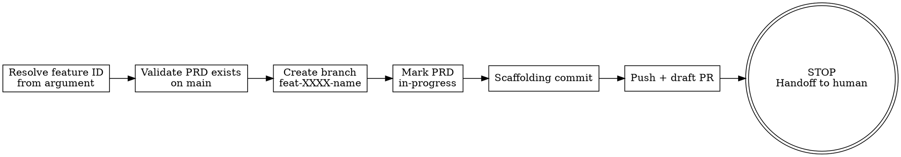

# start-feature

Procedural skill that creates a feature branch, marks the PRD as in-progress, and opens a draft PR. No planning happens here — that's a separate step the human initiates.

## Prerequisites

Before invoking this skill, the following must be true:

1. **PRD exists** — A feature spec must exist at `docs/features/FEAT-XXXX-*.md` on `main`. If it doesn't exist, stop immediately and tell the user: *"No PRD found at `docs/features/` for that feature. Create one first (try brainstorming)."*
2. **Clean working tree** — `git status --porcelain` must be empty. If dirty, stop: *"Uncommitted changes detected. Commit or stash first."*
3. **Branch does not exist** — The target branch `feat-XXXX-name` must not already exist. If it does, stop: *"Branch `feat-XXXX-name` already exists. Switch to it or delete it first."*

## Process Flow



## Step-by-Step Instructions

### 1. Resolve Feature ID

- Parse `FEAT-XXXX` from the argument (e.g., user says "start FEAT-0002" or "start working on FEAT-0002").
- If no feature ID is provided, ask the user.
- The canonical feature ID is always uppercase: `FEAT-XXXX`.
- Find the PRD file: `docs/features/FEAT-XXXX-*.md` on `main`.
- Derive the branch name by lowercasing the filename stem: `FEAT-0002-core-domain-types` -> `feat-0002-core-domain-types`.

### 2. Validate Prerequisites

```bash
# PRD exists on main?
git show main:docs/features/FEAT-XXXX-*.md

# Clean tree?
test -z "$(git status --porcelain)"

# Branch doesn't exist?
! git rev-parse --verify feat-XXXX-name 2>/dev/null
```

If any check fails, print the corresponding error message from Prerequisites and stop.

### 3. Create Feature Branch

```bash
git checkout -b feat-XXXX-name main
```

### 4. Mark PRD In-Progress

Edit the PRD file (`docs/features/FEAT-XXXX-*.md`) to update its status to `in-progress`. The PRD should have a `status` field in its frontmatter or a **Status** heading — update whichever is present. If neither exists, add a status line near the top:

```markdown
**Status:** in-progress
```

Do not add an implementation plan, do not restructure the document. One-line status change only.

### 5. Scaffolding Commit

```bash
git add docs/features/FEAT-XXXX-*.md
git commit -m "docs(FEAT-XXXX): mark in-progress"
```

### 6. Push and Create Draft PR

```bash
git push -u origin feat-XXXX-name
gh pr create --draft --title "FEAT-XXXX: <feature title>" --body "$(cat <<'PREOF'
## Summary
Implementation branch for FEAT-XXXX.

## Status
- [x] PRD reviewed
- [ ] Implementation plan written
- [ ] Implementation started
PREOF
)"
```

### 7. STOP — Handoff to Human

Print this message and **do nothing else**:

```
--- Feature branch ready ---

Branch:  feat-XXXX-name
PR:      <PR URL>
PRD:     docs/features/FEAT-XXXX-name.md

Next steps:
1. Run /plan (or invoke writing-plans) to generate the implementation plan
2. When ready, run /execute-plan in a new session to begin implementation
```

## Error Handling

| Condition | Message |
|-----------|---------|
| No PRD found | "No PRD found at `docs/features/` for FEAT-XXXX. Create one first (try brainstorming)." |
| Branch already exists | "Branch `feat-XXXX-name` already exists. Switch to it or delete it first." |
| Dirty working tree | "Uncommitted changes detected. Commit or stash first." |
| No feature ID provided | Ask the user: "Which feature? Provide the FEAT-XXXX identifier." |
| `gh` CLI not available | "GitHub CLI (`gh`) is required for creating the draft PR. Install it first." |

## Hard Stop Enforcement

**This skill creates the workspace. It does NOT plan or implement the feature.**

Red flags — if you catch yourself doing any of these, STOP immediately:

- Invoking `writing-plans` or any planning skill
- Writing any implementation code
- Creating files outside of `docs/`
- Running `go build`, `go test`, or `make` commands
- Thinking "let me just add a quick plan section"
- Continuing after printing the handoff message
