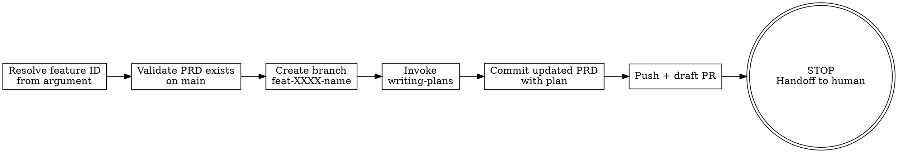

# start-feature

Orchestrates feature branch setup with an implementation plan and draft PR. Wraps `superpowers:writing-plans` with Opax git/PR ceremony. The agent creates everything needed for implementation, then **stops** so a human can review before any code is written.

## Prerequisites

Before invoking this skill, the following must be true:

1. **PRD exists** — A feature spec must exist at `docs/features/FEAT-XXXX-*.md` on `main`. If it doesn't exist, stop immediately and tell the user: *"No PRD found at `docs/features/` for that feature. Create one first (try brainstorming)."*
2. **Clean working tree** — `git status --porcelain` must be empty. If dirty, stop: *"Uncommitted changes detected. Commit or stash first."*
3. **Branch does not exist** — The target branch `feat-XXXX-name` must not already exist. If it does, stop: *"Branch `feat-XXXX-name` already exists. Switch to it or delete it first."*

## Process Flow



## Step-by-Step Instructions

### 1. Resolve Feature ID

- Parse `FEAT-XXXX` from the argument (e.g., user says "start FEAT-0002" or "start working on FEAT-0002").
- If no feature ID is provided, ask the user.
- The canonical feature ID is always uppercase: `FEAT-XXXX`.
- Find the PRD file: `docs/features/FEAT-XXXX-*.md` on `main`.
- Derive the branch name by lowercasing the filename stem: `FEAT-0002-core-domain-types` -> `feat-0002-core-domain-types`.

### 2. Validate Prerequisites

```bash
# PRD exists on main?
git show main:docs/features/FEAT-XXXX-*.md

# Clean tree?
test -z "$(git status --porcelain)"

# Branch doesn't exist?
! git rev-parse --verify feat-XXXX-name 2>/dev/null
```

If any check fails, print the corresponding error message from Prerequisites and stop.

### 3. Create Feature Branch

```bash
git checkout -b feat-XXXX-name main
```

### 4. Generate Implementation Plan

- Read the PRD content from the checked-out branch.
- Invoke `superpowers:writing-plans` with the PRD content as context.
- The plan output goes **into the PRD file** as an `## Implementation Plan` section appended at the end — NOT into `docs/superpowers/plans/`.
- The plan should reference the PRD's acceptance criteria and design decisions.

### 5. Commit the Updated PRD

```bash
git add docs/features/FEAT-XXXX-*.md
git commit -m "docs: add implementation plan for FEAT-XXXX"
```

### 6. Push and Create Draft PR

```bash
git push -u origin feat-XXXX-name
gh pr create --draft --title "FEAT-XXXX: <feature title>" --body "$(cat <<'PREOF'
## Summary
Implementation branch for FEAT-XXXX. Plan is in the PRD — review before approving.

## Status
- [x] PRD reviewed
- [x] Implementation plan written
- [ ] Human review of plan
- [ ] Implementation started
PREOF
)"
```

### 7. STOP — Handoff to Human

Print this message and **do nothing else**:

```
--- Feature branch ready for review ---

Branch:  feat-XXXX-name
PR:      <PR URL>
PRD:     docs/features/FEAT-XXXX-name.md

Next steps:
1. Review the implementation plan in the PRD
2. Approve or request changes on the draft PR
3. When ready, run `executing-plans` in a new session to begin implementation
```

## Error Handling

| Condition | Message |
|-----------|---------|
| No PRD found | "No PRD found at `docs/features/` for FEAT-XXXX. Create one first (try brainstorming)." |
| Branch already exists | "Branch `feat-XXXX-name` already exists. Switch to it or delete it first." |
| Dirty working tree | "Uncommitted changes detected. Commit or stash first." |
| No feature ID provided | Ask the user: "Which feature? Provide the FEAT-XXXX identifier." |
| `gh` CLI not available | "GitHub CLI (`gh`) is required for creating the draft PR. Install it first." |

## Hard Stop Enforcement

**This skill creates the workspace. It does NOT implement the feature.**

Red flags — if you catch yourself doing any of these, STOP immediately:

- Writing any Go code (or any implementation code)
- Creating files outside of `docs/`
- Running `go build`, `go test`, or `make` commands
- Modifying `go.mod` or `go.sum`
- Thinking "let me just start one small task from the plan"
- Skipping the draft PR step
- Continuing after printing the handoff message

The human reviews the plan. The human decides when to start. Implementation happens in a separate session using `executing-plans`.
